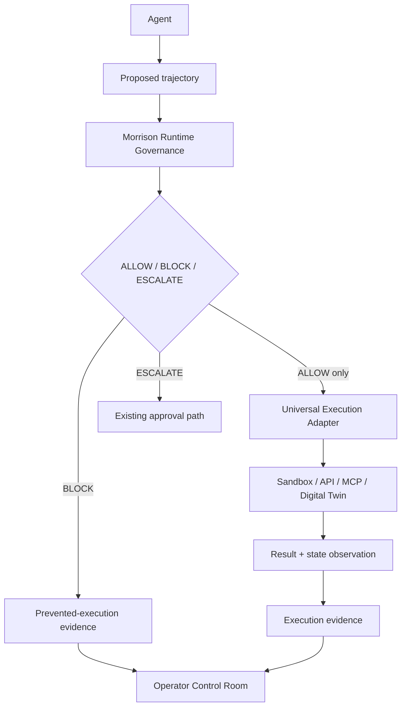

# Universal Governed Execution

## Purpose

Morrison Runtime Governance already evaluates proposed trajectories through the authenticated runtime gateway and records `ALLOW`, `BLOCK`, or `ESCALATE` decisions. The execution-adapter layer adds a common, evidence-producing boundary between an authorized decision and an external execution environment. It does not replace the engine, `/api/runtime/evaluate`, the Frontier Lab, the Control Room, existing connectors, or approval semantics.

The supported product claim is deliberately bounded:

> Morrison can govern any execution environment that exposes a sufficiently controllable pre-execution boundary.

The platform does **not** claim that Morrison works with every environment. The capability manifest and readiness assessment make the boundary visible.

## Architecture



The public execution route is `POST /api/runtime/execute`. It uses the same customer/environment API-key authentication as `/api/runtime/evaluate`, then invokes `gateway.govern()`. `/api/runtime/evaluate` is unchanged.

## Authorization invariant

`NO_EXTERNAL_EXECUTION_WITHOUT_A_VALID_MORRISON_ALLOW_DECISION`

The flow enforces the invariant as follows:

1. The existing runtime gateway calls the engine's `/v1/govern` chokepoint.
2. Morrison's decision must be successfully retained with a real `decision_id`.
3. `BLOCK` records `blocked_before_execution` and never calls state observation or `adapter.execute()`.
4. `ESCALATE` records `escalated` and does not execute until the existing approval path authorizes a later action.
5. Only a retained `ALLOW` can mint a short-lived, one-use in-process execution grant bound to the adapter, decision and correlation ID.
6. A registry-returned adapter consumes that grant before dispatch. Reuse or a forged object fails closed. State-changing `reset()` calls are also gated and require a separate grant bound to the reset operation.
7. Execution evidence is initialized before dispatch and finalized after the result/state observations.

Clients cannot submit a verdict or authorization token as authority. `morrison_verdict`, `verdict`, and `authorization` are rejected by the public route.

### Actual trust boundary

The one-use grant prevents route-level bypasses and accidental direct use of registered adapters. It is not described as a cryptographic sandbox against arbitrary code already trusted to run inside the same Node.js process. Such code could import a raw adapter module or modify process memory. Production integrity therefore also depends on code review, deployment integrity, module access discipline, and exposing only `/api/runtime/execute` as the public execution path. This is an explicit trust boundary, not a claim of impossible same-process isolation.

## Adapter contract

An adapter declares:

- `id`, `name`, and `version`
- `capabilities` (object or configuration-derived function)
- `validateConfiguration(config, trustedDependencies)`
- `health()`
- `execute()`
- `normalizeResult()`

Optional functions are capability-driven:

- `observeState()` when `state_read` is true
- `reset()` when reset/replay is supported

Adapters live under `lib/runtime/execution-adapters/adapters/`. The registry validates the contract and wraps the execution function with the authorization gate.

### Provider-neutral provisioning metadata

An adapter may also expose a descriptive `provisioning` manifest. This is not an execution capability and never grants authorization. It lets the existing Control Room explain how an operator prepares an external environment using provider-supported credential modes and setup transports (`manual`, `http_api`, `cli`, or `mcp`), then hands the resulting run ID/endpoints into the adapter configuration.

The optional lifecycle vocabulary covers catalog, provision, seed, status, reset, extend, lock, teardown, and structured output. These flags describe the provider's setup surface only. For example, a documented reset command does **not** imply `deterministic_reset`, equivalent initial state, or a successful reset; those claims still require execution capability confirmation and evidence.

## Capability manifest

Every manifest is normalized to explicit booleans for:

`pre_execution_hook`, `state_read`, `state_write`, `state_diff`, `replay`, `multi_step`, `permission_control`, `policy_context`, `deterministic_reset`, `execution_receipts`, `idempotency`, `streaming`, `mcp`, `http`, and `cli`.

Capabilities are adapter/configuration-specific. For example, the generic sandbox advertises `state_read` only when a state endpoint is configured, and `deterministic_reset` only when a reset endpoint exists **and** the operator explicitly confirms that reset is deterministic.

## Safety-claim readiness

Readiness assesses whether an integration can support the intended experiment. It never declares the environment safe.

| Level | Meaning |
|---|---|
| `FULL_ENFORCEMENT_READY` | A pre-execution boundary, observable state, state-changing execution and receipts are exposed. Comparable starting state is reported separately. |
| `PARTIAL_OBSERVABILITY` | Morrison can gate execution, but state or receipt evidence is incomplete. |
| `REPLAY_ONLY` | Observations can be replayed, but no controllable pre-execution hook is declared. |
| `NO_PRE_EXECUTION_HOOK` | An execution surface exists, but Morrison cannot be placed before it. |
| `INSUFFICIENT_FOR_LOCAL_SAFETY_CLAIM` | Declared capabilities are insufficient for the experiment. |

`FULL_ENFORCEMENT_READY` means ready to run a falsifiable experiment; it does not mean the result is safe or that every reachable state has been proven safe.

## Built-in adapters

### Generic HTTP

Supports an HTTPS target, method, headers, body mapping, bounded timeout/response capture, request/correlation IDs, receipts and idempotency keys. It requires an explicit host allowlist, resolves DNS before dispatch, pins the chosen public address for the request, rejects URL credentials, and denies local/private/special-use addresses. Receipts redact sensitive header values.

HTTP is development-only when explicitly enabled and remains disallowed by default.

### Generic sandbox

Configures a provider-neutral `base_url`, action path, environment/twin/session identity, and optional state, health, replay and reset paths. It uses the same governed execution model regardless of sandbox provider.

### MCP

Requires an MCP client and tool allowlist bound by trusted server configuration. A client request cannot provide its own MCP client implementation or tool policy.

### CLI

Requires a command allowlist, working-directory policy, and per-invocation validator supplied by trusted server policy. Client-supplied allowlists are not accepted. Commands run without a shell.

### Arga Labs

Arga is the first named sandbox implementation. Its public documentation now confirms the onboarding shape shown in the live product: authenticate with an API key or `arga login`, install `arga-cli`, use `arga wizard` (`arga wizard init` remains a compatibility command), provision stateful service twins, and point the application at returned provider-compatible URLs/environment variables. Arga also documents CLI/MCP lifecycle operations such as catalog, provision, status, reset and teardown, plus JSON output. The Control Room renders these as a three-step, manifest-driven setup guide: authenticate provider → set up transport → hand the provisioned target to the adapter.

This documentation does **not** make Arga the governance architecture and does not turn provisioning into authorization. The shell therefore still:

- invents no action or state endpoint;
- declares no execution capability by default;
- never executes setup commands;
- requires `integration_surface_confirmed` from trusted server configuration;
- requires operator-supplied transport paths; and
- requires trusted-server `confirmed_capabilities` (client payloads cannot assert them).

Still unresolved for production execution are the exact action-routing schema/path, state inspection schema/path, normalized receipt shape, idempotency behaviour, and trustworthy pre/post-state capture semantics. Arga documents reset availability, but Morrison must not call it deterministic or use it to claim comparable starting state without verified reset evidence.

Provider references: [CLI and MCP](https://docs.argalabs.com/cli-and-mcp), [Quickstart](https://docs.argalabs.com/quickstart), and [Local testing](https://docs.argalabs.com/features/local-testing).

## Evidence flow

`rg_execution_records` extends the existing runtime evidence model. Each record links:

- organization, runtime environment and optional governed session;
- scenario/experiment role and correlation ID;
- trajectory hash and exact Morrison decision ID;
- Morrison verdict, rule and Ω domain;
- adapter identity/version/capabilities and external target identity;
- execution status, attempt/result/receipt and timestamp;
- state hashes, redacted bounded state, delta and observability errors where available;
- runtime mode and authorization result; and
- a canonical execution-evidence hash.

The status vocabulary distinguishes `authorized`, `executed`, `blocked_before_execution`, `escalated`, `execution_failed`, and `state_unknown`.

If an adapter times out after dispatch may have begun, the result is `state_unknown` and `executed` is `null`. It never silently assumes that nothing happened. If state cannot be read, `external_state_changed` is `null`/`UNKNOWN`, never `false`.

Apply `supabase/universal_governed_execution.sql` to production Supabase projects before enabling external execution. The local file store creates the additive collection automatically for development/tests.

## Baseline and governed pilot comparison

An ungoverned baseline must be run only in an isolated pilot harness, never through the governed public endpoint. The internal `recordBaselineObservation()` helper records an already-observed baseline only when a trusted-server harness flag is present; it never dispatches an action. Client requests cannot label a governed run as a baseline. Both records must use the same `scenario_id`, `correlation_id`, and proposed trajectory hash.

The pairing helper calls initial conditions equivalent only when:

- the observed starting-state hashes match; or
- both runs carry the same verified reset-evidence hash from a trusted pilot harness.

Declaring a `deterministic_reset` capability is not itself evidence that reset occurred. If neither condition is established, the Control Room may show the runs beside each other but must not label them equivalent. This prevents a visual comparison from becoming a false causal claim.

## Adding another sandbox provider

1. Implement the common adapter contract in `adapters/<provider>.js`.
2. Optionally publish a normalized provisioning manifest for operator onboarding; do not execute setup commands from that manifest.
3. Declare only capabilities confirmed by the provider and the supplied configuration. Never infer execution readiness from provisioning metadata.
4. Keep credentials in the existing trusted secret/configuration infrastructure; never return them in receipts.
5. Normalize provider results into `ok`, `executed`, `result`, and `receipt` without converting ambiguous outcomes into success/failure claims.
6. Add the adapter to the registry.
7. Test `ALLOW` once, `BLOCK` zero times, `ESCALATE` zero times, unavailable engine/config, state observability, timeout ambiguity, idempotency and direct-use rejection.
8. Surface provisioning, capability/readiness and recent evidence in the existing Control Room.

## Example integration sequence

```http
POST /api/runtime/execute
Authorization: Bearer rtk_live_...
Content-Type: application/json

{
  "trajectory": [{ "tool": "apply_change", "args": { "change_id": "change-42" } }],
  "domains": ["enterprise"],
  "adapter": "sandbox",
  "adapter_config": {
    "base_url": "https://pilot.example.com/",
    "allowed_hosts": ["pilot.example.com"],
    "environment_id": "twin-7",
    "action_path": "/v1/actions",
    "state_path": "/v1/state"
  },
  "context": { "session_id": "session-9", "scenario_id": "scenario-3" },
  "correlation_id": "comparison-2026-08-27",
  "idempotency_key": "session-9-step-4"
}
```

The sequence is: authenticate → govern → retain decision → initialize evidence → mint bound grant → optional pre-state read → execute once → optional post-state read → finalize linked evidence → render in the existing Control Room.
